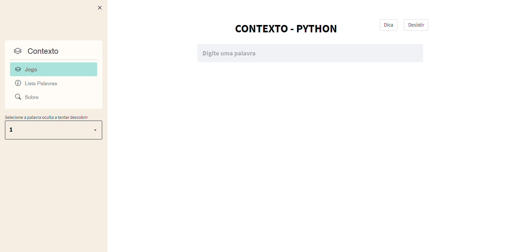
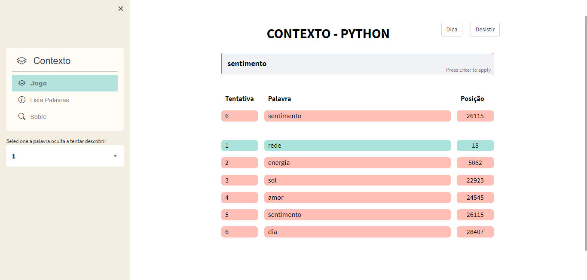
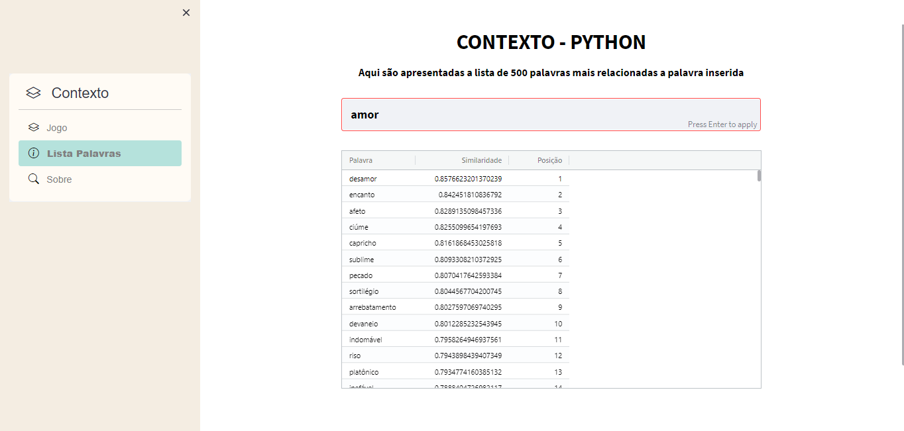
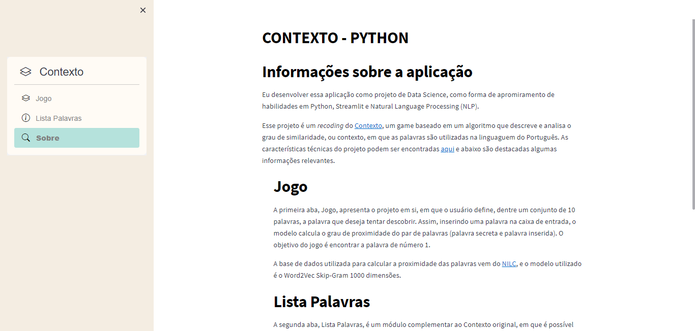

# RECODING CONTEXTO GAME IN PYTHON

[Contexto](https://contexto.me/) is a a game based on an algorithm that describes and analyzes the degree of similarity, or context, in which words are used in the Portuguese language. This project, is a recoding of this system, using the same data and techniques in Python.

## Motivation
This project aims to use Natural Language Processing (NLP) using Word2Vec and Gensim to build a complete system based on Game Contexto.

## Objectives
1. To recreate a Context system for improve Data Science and NLP skills
2. To build a Data Science project using techniques other than commonly used machine learning

## Dataset Overview
- Skip-gram 1000 dimensões: A txt document (2.8 GB) containing 929606 trained words and represented as a vector with 1000 numeric values
    - column1: the word
    - column2 - column1001: the numeric values
    
- Skip-gram 50 dimensões: A txt document (168 MB) containing 929606 trained words and represented as a vector with 50 numeric values
    - column1: the word
    - column2 - column51: the numeric values

- Lista de palavras Português-BR: A single column contains 261798 Brazilian Portuguese words

Dataset Source:
1. [Skip-gram 1000 dimensões](http://nilc.icmc.usp.br/nilc/index.php/repositorio-de-word-embeddings-do-nilc)
2. [Skip-gram 50 dimensões](http://nilc.icmc.usp.br/nilc/index.php/repositorio-de-word-embeddings-do-nilc)
3. [Lista de palavras Português-BR](https://www.ime.usp.br/~pf/estruturas-de-dados/aulas/sandbox/br-utf8.txt)

## Results
The developed system is a available [here](), and contains the following features:

### Page 1: Jogo
The first "Jogo" page presents the main application, which is the same resource present in the original Context system. In this system,
there are 10 different words for the user to choose, and after that, the user tries to find the secret word by writing other words, and the system tells how far or close the entered word is from the secret word. The objective is to find the word number 1.

  

### Page 2: Lista Palavras
The second "Lista Palavras" page presents an additional application not found in the original system, which allows the user to find the 500 most similar words for the word typed.

  

### Page 3: Sobre
The final "Sobre" page presents some information about the project and the based system.

  

Note: The system has been fully developed for Portuguese speakers, which means that any word entered in the system must be in Portuguese.

## Contact
Please, be welcome to copy and modified this project for improvement and changes. I am available for doubls and any discuss, and you can find and send me message by thoses links:

  
  
  
  

